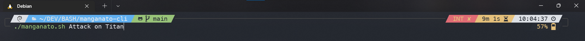
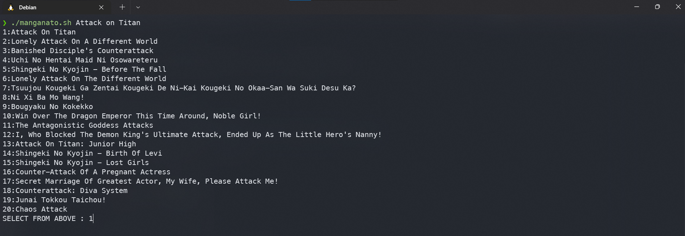
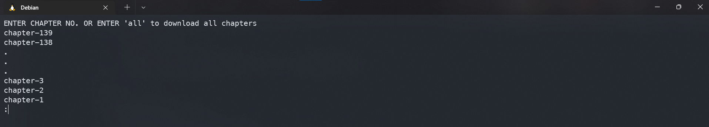
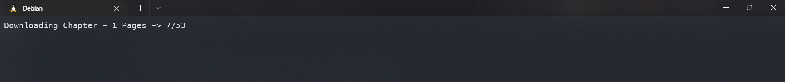
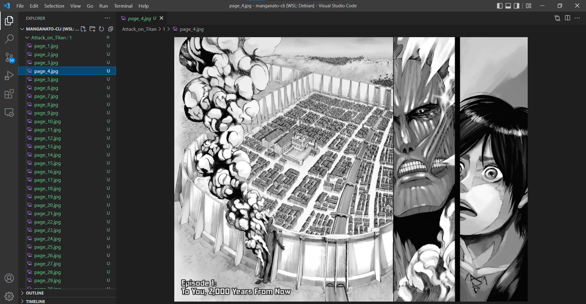

# manganato-cli
## A cli based manga downloader for linux written in BASH script. You can choose to download individual pages as well as in a combined PDF form(it requires another package called img2pdf). Below are some screenshots showing the usage of this application.

